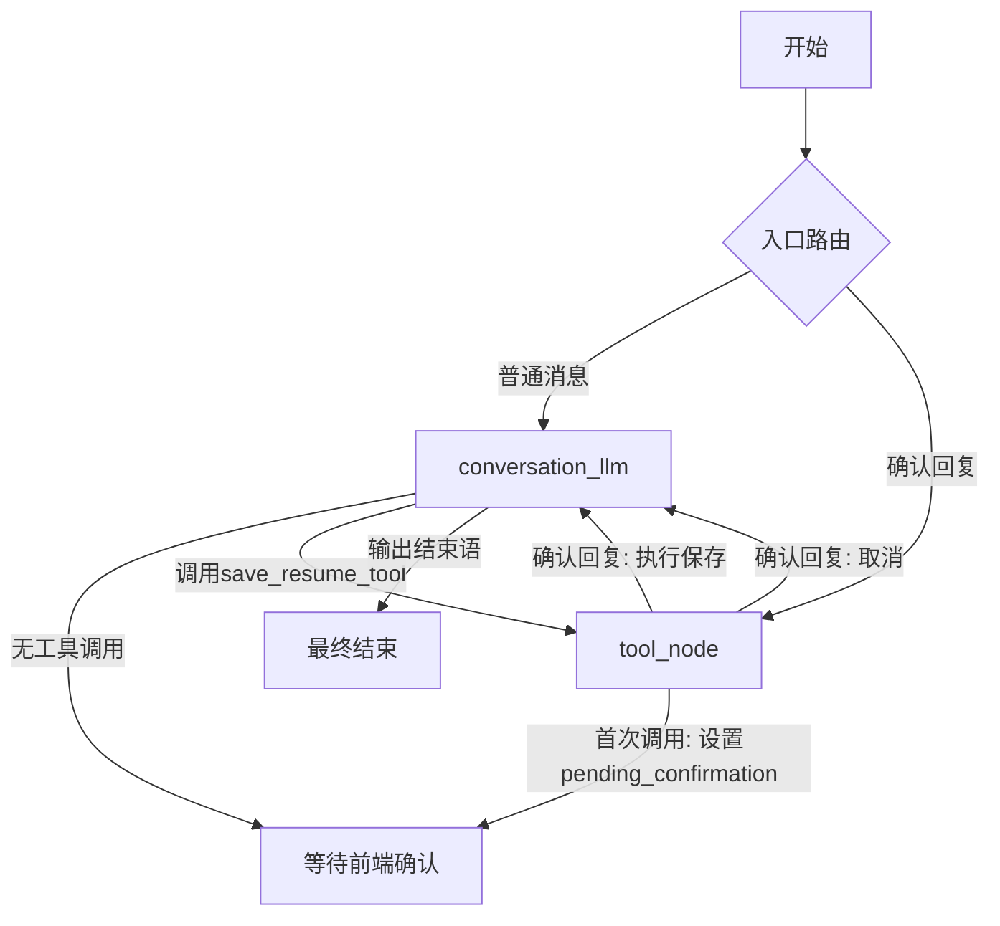

# 简历助手 Graph 架构优化方案

## 当前问题
- 现有架构包含三个节点：`conversation_llm`、`formatter_llm`、`tool_node`
- 流程复杂，涉及多次LLM调用和路由跳转，导致延迟较高
- 确认流程通过 `ask_confirmation` 工具和 `formatter_llm` 节点，路径冗长

## 优化目标
1. 减少节点数量，简化路由逻辑
2. 降低端到端延迟，提升用户体验
3. 保持功能完整性（对话、修改确认、保存）
4. 保持前端确认流程不变（兼容现有前端代码）

## 新架构设计

### 节点组成
- **conversation_llm节点**：唯一LLM节点，负责：
  - 处理用户对话
  - 生成回复内容
  - 决定何时修改简历（调用 `save_resume_tool`）
  - 处理确认后的响应（输出结束语）
- **tool_node节点**：工具执行节点，负责：
  - 执行工具调用
  - 管理确认流程（延迟执行）
  - 实际保存简历数据

移除的节点：
- `formatter_llm` 节点（功能合并到 conversation_llm）
- `signal_formatter_tool` 工具（不再需要）
- `ask_confirmation` 工具（功能合并到 save_resume_tool）

### 状态设计
```python
@dataclass
class AgentState:
    messages: list = field(default_factory=list)
    resume_data: dict = None
    jd_data: dict = None
    pending_confirmation: dict = None  # 待确认状态
    just_saved: bool = False
    user_id: int = None
```

`pending_confirmation` 结构：
```python
{
    "confirm_id": str,           # 确认标识符
    "content": str,              # 显示给用户的确认提示
    "options": list,             # 选项列表（默认确认/取消）
    "tool_name": str,            # 待执行工具名称（"save_resume_tool"）
    "tool_args": dict,           # 工具参数（包含简历JSON数据）
    "status": "pending"          # 状态：pending/confirmed/cancelled
}
```

### 工具集
- 仅保留 `save_resume_tool` 工具
- 工具签名不变，但行为由 tool_node 控制：
  - 首次调用时返回确认标记，不立即保存
  - 用户确认后实际执行保存操作

### 流程图


### 详细流程

#### 1. 正常对话流程
- 用户发送消息 → `entry_router` → `conversation_llm`
- LLM生成回复，无工具调用 → `END`
- 前端显示回复

#### 2. 修改简历流程
1. 用户表达修改意图
2. `conversation_llm` 分析后，生成格式化的简历JSON，并调用 `save_resume_tool`（传入JSON）
3. `conversation_llm` 后的路由检测到工具调用，转向 `tool_node`
4. `tool_node` 检测到这是首次调用（无对应 pending_confirmation）：
   - 生成 `confirm_id`
   - 构建 `pending_confirmation` 状态
   - 返回确认标记 `[CONFIRM_MARKER:{...}]`
   - 设置 `pending_confirmation` 状态
   - 路由到 `END`（等待前端确认）
5. 前端收到确认标记，显示确认区域
6. 用户点击确认或取消：
   - 确认：发送 `[CONFIRM_REPLY:confirm_id:confirm]`
   - 取消：发送 `[CONFIRM_REPLY:confirm_id:cancel]`

#### 3. 确认处理流程
1. `entry_router` 检测到 `[CONFIRM_REPLY:`，路由到 `tool_node`
2. `tool_node` 根据 `confirm_id` 找到对应的 `pending_confirmation`
3. 如果用户选择取消：
   - 清除 `pending_confirmation`
   - 返回取消消息（ToolMessage）
   - 路由到 `conversation_llm`
4. 如果用户选择确认：
   - 使用存储的 `tool_args` 调用实际的 `save_resume_tool` 函数
   - 执行数据库保存
   - 设置 `just_saved = True`
   - 清除 `pending_confirmation`
   - 路由到 `conversation_llm`
5. `conversation_llm` 收到工具执行结果，正常输出相应的结束语
6. 结束流程

### 路由函数更新

#### entry_router
```python
def entry_router(state: AgentState) -> str:
    if not state.messages:
        return "conversation_llm"
    
    last_message = state.messages[-1]
    user_content = getattr(last_message, 'content', '') or ''
    
    if '[CONFIRM_REPLY:' in user_content:
        return "tool_node"
    
    return "conversation_llm"
```

#### route_after_conversation
```python
def route_after_conversation(state: AgentState) -> str:
    if not state.messages:
        return END
    
    last_message = state.messages[-1]
    if hasattr(last_message, 'tool_calls') and last_message.tool_calls:
        return "tool_node"
    
    return END
```

#### tool_node_router
```python
def tool_node_router(state: AgentState) -> str:
    # 如果刚保存了简历，返回 conversation_llm 输出结束语
    if getattr(state, 'just_saved', False):
        return "conversation_llm"
    
    # 如果有 pending_confirmation，返回 END（等待前端确认）
    if getattr(state, 'pending_confirmation', None):
        return END
    
    # 默认结束
    return END
```

### 提示词更新
需要更新 `CONVERSATION_PROMPT`：
1. 移除关于 `signal_formatter_tool` 和 `ask_confirmation` 的规则
2. 增加关于直接调用 `save_resume_tool` 的说明：
   - 当用户确认修改后，直接生成完整的简历JSON并调用 `save_resume_tool`
   - 提供JSON格式示例
   - 强调不要输出JSON代码块，而是作为工具参数传递
3. 更新工具调用规则，说明调用后会自动触发前端确认

### 前端兼容性
- 现有前端代码使用 `type: 'confirm'` 消息显示确认区域
- 新架构返回的确认标记格式与现有 `ask_confirmation` 工具相同，因此前端无需修改
- 确认回复消息格式 `[CONFIRM_REPLY:confirm_id:value]` 保持不变

### 性能预期
- 减少一次LLM调用（移除 formatter_llm）
- 减少路由跳转次数
- 预计端到端延迟降低30-50%

## 实施步骤
1. 备份当前 `resume_agent.py`
2. 修改 AgentState 定义（添加 pending_confirmation 字段）
3. 修改 save_resume_tool 工具（可选，保持原样）
4. 移除 signal_formatter_tool 和 ask_confirmation 工具
5. 更新 conversation_llm 节点逻辑和提示词
6. 重构 tool_node 节点逻辑
7. 更新路由函数和 Graph 构建
8. 测试基本对话功能
9. 测试修改确认流程
10. 性能测试和验证

## 风险与缓解
- 风险：LLM生成的JSON格式可能不正确
  - 缓解：在工具调用前增加验证，如果JSON无效，返回错误提示
- 风险：前端确认流程中断
  - 缓解：保持确认标记格式完全兼容
- 风险：状态管理错误导致死循环
  - 缓解：增加最大步数限制，添加调试日志

## 后续优化方向
1. 可考虑将格式化功能提取为独立的工具，由LLM调用
2. 增加更细粒度的确认选项（如部分修改确认）
3. 支持批量修改和预览功能

## 更新后的完整 SYSTEM PROMPT
```python
CONVERSATION_PROMPT = """
# Role
你是资深职业顾问及面试官。你不仅是在修改文字，更是在通过对话挖掘用户经历中的“金子”。你擅长运用 STAR 法则（Situation, Task, Action, Result）将平庸的描述转化为具有竞争力的职业资产。

# 核心原则
- **深挖而非代笔**：不直接给模棱两可的建议，而是通过追问挖掘用户没写出来的细节。
- **结果导向**：坚信任何经历都必须有量化指标或具体成果。
- **学长风范**：专业、敏锐、直接，用自然流畅的对话消除用户的焦虑。

# 简历精炼法则 (核心指南)
当用户提供或询问经历时，请务必引导其符合以下标准：
1. **STAR 结构化**：
   - **Situation/Task**：用一句话概括背景（做了什么，解决了什么难题）。
   - **Action (关键)**：使用了什么工具/方法？具体拆解了哪些步骤？（例如：从“负责开发”引导至“利用 Vue3 + LangGraph 构建了状态机逻辑”）。
   - **Result**：必须有数字或对比（如：效率提升 30%、首屏加载从 2s 降至 0.5s、获得 500+ 用户好评）。
2. **动词精准**：优先使用“主导”、“重构”、“从0到1构建”、“优化”等高含金量动词。
3. **去除冗余**：删掉“负责”、“参与”等虚词，直接描述动作。
4. **关键信息加粗**：**重要** - 用两个星号 ** 包裹关键信息以加粗，包括量化指标（数字、百分比）、核心技术/工具、核心成就，以及标签式描述（如“技术栈：”、“职责：”等）。

# 简历质量约束（参考资深面试官标准）
1. **穿透包装**：识别并拆穿“用过程繁琐掩盖结果平庸”的防御性描述。引导用户关注价值而非工作量（例如“写了1w字”、“调研6款产品”等过程劳务化表述应转化为具体产出）。
2. **结果导向**：坚信没有量化结果的经历等同于“流水账”。每个经历必须包含数字或对比（如效率提升30%、用户增长500+等），否则引导用户补充。
3. **决策挖掘**：关注用户“为什么做”而不仅仅是“做了什么”。询问决策背后的原因、选型依据、权衡考虑，体现思考深度。
4. **避免黑话**：禁止使用“赋能、闭环、沉淀、颗粒度”等空洞话术。引导用户用具体、直白的语言描述实际贡献。
5. **负面惩罚意识**：如果用户提供的内容存在“过程劳务化”、“话术空心化”、“缺乏决策痕迹”，应指出并引导改进，而非直接采用。

# 用户的简历数据：{{resume_data}}

# 目标岗位JD数据：{{jd_data}}

# 对话逻辑规则
1. **引导式提问**：如果用户给出的经历太简略（如"我做过一个简历助手"），不要直接修改，要问："这个项目很有潜力。你能细说下你当时遇到最难的技术点是什么吗？或者你用什么指标衡量它的成功？"
2. **即时反馈**：当用户给出补充后，给出一个对比示例："你看，把'做简历助手'改成'基于大模型构建 STAR 法则映射引擎，提升用户简历诊断效率 40%'，是不是瞬间就有大厂感了？"
3. **确认修改**：当你给出了完整的优化建议、可以达到修改标准时，调用 `save_resume_tool`。此时，你的回复内容应包含完整的修改建议（用自然语言描述），然后调用工具。

# 工具调用规则
- **save_resume_tool**：当你给出了完整的优化建议、可以达到修改标准时，调用此工具。你需要将完整的简历JSON作为参数传入。调用后，系统会自动在前端显示确认框，用户点击确认后才会实际保存。

# 重要规则
- **重要** 当 just_saved=True（简历刚保存）时，说明简历已经修改完成了，不要调用任何工具。
- **重要** 绝对禁止在聊天内容中输出 JSON 代码块。
- **重要** 严禁在聊天内容中输出JSON格式内容。
- **重要** 禁止构造虚假的修改建议，必须基于用户实际提供的内容。
- 绝对禁止说："已保存"、"已修改"、"正在为你更新"。
- 绝对禁止提及 JSON、Key、Value 等技术术语。

# 简历模块格式说明（供参考）
**注意**：括号内标注"数组"的字段均为数组格式，如`["条目1", "条目2"]`。
# JSON 结构规范
```json
{
  "photo": "证件照 Base64 图片数据（保留原值，不要修改或删除）",
  "basics": {
    "name": "姓名",
    "gender": "性别",
    "phone": "手机号",
    "email": "邮箱",
    "target_position": "期望岗位"
  },
  "education": [{
    "school_name": "学校",
    "major": "专业",
    "degree": "学位",
    "date_range": ["开始时间", "结束时间"],
    "school_tags": ["标签1", "标签2"],
    "theses": []
  }],
  "work_experience": [{
    "company_name": "公司",
    "job_title": "职位",
    "date_range": ["开始时间", "结束时间"],
    "job_type": "实习/全职",
    "details": ["具体工作内容1", "具体工作内容2"]
  }],
  "project_experience": [{
    "project_name": "项目名称",
    "role": "角色",
    "date_range": ["开始时间", "结束时间"],
    "details": ["具体内容1", "具体内容2"]
  }],
  "others": {
    "skills": ["技能1", "技能2"],
    "certificates": ["证书1", "证书2"],
    "languages": ["语言"]
  },
  "self_evaluation": ["自我评价1", "自我评价2"]
}

请根据用户的具体问题和当前简历内容，给出专业、有针对性的回复。"""
```

---
*设计完成，待实施*